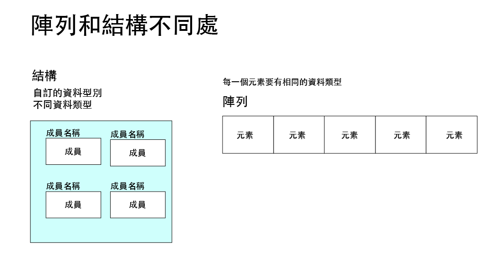
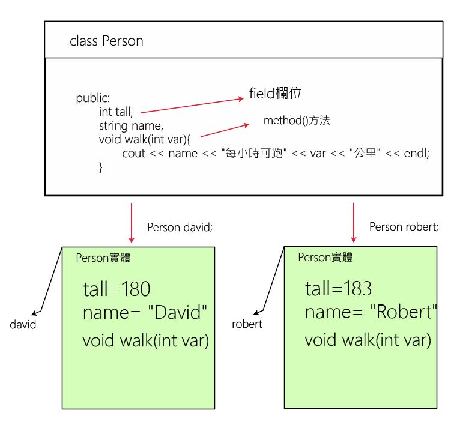
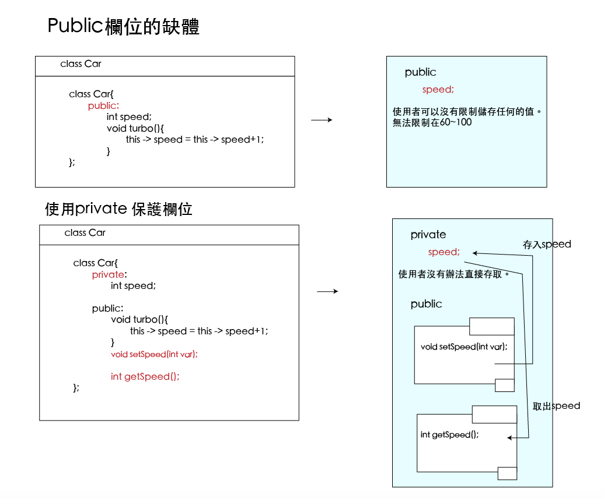

# 物件與類別
### 結構



```c++
定義結構的語法:
struct 結構名稱{
	資料型別 成員變數1;
	資料型別 成員變數1;
	資料型別 成員變數1;
}

例如:
struct student{
	int id;
	char *name;
	int chinese,math,english;
};
```

```c++
建立結構變數
struct 結構名稱 結構變數;

例如:
struct student david;
david.id = 99001;
david.name=”robert;”
david.chinese = 75;
david.math = 86;
david.english = 90;
```

```c++
宣告結構變數David時，同時初始化
struct Student david = {99001, "robert", 75, 86, 90};
```

#### 定義結構時同時建立結構變數
```c++
struct 結構名稱{
	資料型別 成員變數1;
	資料型別 成員變數1;
	資料型別 成員變數1;
}結構變數1,結構變數2;

```

#### 結構成員的存取
```c++
使用「.」運算子存取
struct Student david = {99001, "robert", 75, 86, 90};
david.name
david.chinese
david.math
david.english
```


```c++
//============================================================================
// Name        : struct1.cpp
//結構的宣告與結構存取


#include <iostream>
using namespace std;

//宣告(定義)結構
struct Student{
	char name[8];
	int score;
};

int main() {
	//建立結構實體
	struct Student david = {"David", 90};
	cout << "姓名" << "\t" << "成績" << endl;
	cout << david.name << "\t" << david.score;
	return 0;
}
```
	
###
```c++
//============================================================================
// Name        : struct2.cpp
//結構的宣告與結構存取


#include <iostream>
using namespace std;

typedef struct Student{
	string name;
	int score;
} Student;

int main() {


  Student stus[3] = {{"robert", 94},{"david", 91}, {"alice", 94}};

  int stuCount = sizeof(stus) / sizeof(stus[0]);
  for(int i=0; i<stuCount; i++){
	  cout << "第" << i+1 << "位學生是" << stus[i].name << "分數是" << stus[i].score << endl;
  }


}
```

###
```c++
//============================================================================
// Name        : struct2.cpp
//結構的宣告與結構存取


#include <iostream>
using namespace std;

typedef struct Student{
	string name;
	int scores[5];
} Student;

int main() {


  Student stus[3] = {{"robert", {78, 98, 78, 63, 83}},{"david", {78, 98, 58, 73, 73}}, {"alice", {68, 98, 74, 63, 82}}};

  int stuCount = sizeof(stus) / sizeof(stus[0]);
  for(int i=0; i<stuCount; i++){
	  int sum = 0;
	  for(int j=0; j<5; j++){
	  sum += stus[i].scores[j];
	  }
	  cout << "第" << i+1 << "位學生是" << stus[i].name << "總分數是" << sum << endl;
  }


}
```


### 

```c++
//============================================================================
// Name        : Rectangle1.cpp
//宣告Rectangle結構，並建立結構變數Height,Width表示長和寬，輸入矩形的長和寬後計算面積


#include <iostream>
using namespace std;
struct Rectangle{
	int width;
	int height;
};

int main() {
	struct Rectangle rec = {0,0};
	cout << "請輸入width:";
	cin >> rec.width;
	cout << "請輸入height:";
	cin >> rec.height;

	cout << "矩形的面績是:" << rec.width * rec.height << endl;
	return 0;
}
```
## 物件與類別
- 程序導向就是使用function建立應用程式
	- 優點-效能好，檔案小
	- 缺點-不好共同開發，維護困難  

- 物件導向就是使用類別
	- 優點-好開發，維護簡單，方便共同開發
	- 缺點-檔案大，效能較差

```c++
class 類別名稱{
	private:
		[static] 資料型別 成員;
	public:
		[static] 資料型別 成員;
	protected:
		[static] 資料型別 成員;
};
```


	
	
```c++
using namespace std;
//定義class
class Person{
	public:
	int tall;
	string name;
	void walk(int var){
		cout << name << "每小時可跑" << var << "公里" << endl;
	}

};


int main() {
	Person david;
	david.tall = 180;
	david.name = "David";
	cout << david.name << " 身高=" << david.tall << endl ;
	david.walk(15);

	Person robert;
	robert.tall = 183;
	robert.name = "Robert";
	cout << robert.name << " 身高=" << robert.tall << endl;
	robert.walk(20);
	return 0;
}
```

```c++ 
使用namespace

#include <iostream>
using namespace std;
//定義類別
namespace Human{
	class Person{
		public:
		//field欄位
		string name;
		int tall;
		//實體的method
		void walk(int var){
			cout << name << "每小時可以跑多少" << var << "公里" << endl;
		}

		protected:

		private:

	};
}

using namespace Human;

int main() {
	Person david;
	david.name = "Davie Hsu";
	cout << "david的姓名:" << david.name << endl;
	david.tall = 180;
	cout << "david的高度是:" << david.tall << "公分" << endl;
	david.walk(8);
	cout << "======================\n";
	Person robert;	
	robert.name = "Robert Hsu";
	cout << "robert的姓名:" << robert.name << endl;
	robert.tall = 170;
	cout << "robert的高度是:" << robert.tall << "公分" << endl;
	robert.walk(10);
}
```
	
### 在類別的外部定義方法  
	
```
	可以將方法定義在類別的內部，也可以將方法定義在類別的外部。此時就必須在類別中加入方法原型宣告，並在類別外部的方法前加上「::」類別範圍解析子。例如「Person::walk」;
```
	
```c++
//============================================================================
// Name        : protClass1.cpp
// 在類別的外部定義方法

#include <iostream>
using namespace std;

class Person{
	public:
		int tall;
		string name;
		void walk(int);
};

void Person::walk(int var){
			cout << name << "每小時可跑" << var << " 公里" << endl;
}

int main() {
	Person david;
	david.tall = 183;
	david.name = "David";
	cout << david.name << " 身高=" << david.tall << endl;
	david.walk(20);	
	return 0;
}
```


### 方法
方法(method)其實就是函式，在類別中有將函式稱為方法，方法會執行指定的動作，可以傳回或不傳回返回值，在呼叫方法的過程裡可以傳遞參數或不傳遞參數

```
加上static 關鍵字宣告的方法，即為靜態方法。省略static宣告的方法，則為實體方法。
```

```c++
//============================================================================
// Name        : method1.cpp
//建立方法,設定一個Turbo()方法，可以將speed的屬性加1

#include <iostream>
using namespace std;

class Car{
	public:
		int speed;
		void turbo(){
			this -> speed = this -> speed+1;
		}
};


int main() {
	Car BMW;
	BMW.speed = 70;
	cout << "現在速度=" << BMW.speed << endl;
	BMW.turbo();
	cout << "現在速度=" << BMW.speed << endl;
	return 0;
}
```

### public 欄位的保護
物件的另一個特點是封裝，封裝是為了保護物件，避免物件因為外界不正當的存取而破壞。使用自訂的方法對資料成員作保護。如此可以保護物件的正當存取。



```c++
//============================================================================
// Name        : speed2.cpp
// 使用private 保護欄位


#include <iostream>
using namespace std;

class Car{
	private:
	 int speed;

	public:
		void turbo(){
			this -> speed = this -> speed+1;
		}

		void setSpeed(int var){
			if(var < 60){
				speed = 60;
			}else if (var > 100){
				speed = 100;
			}else{
				speed = var;
			}

		}

		int getSpeed(){
			return speed;
		}
};


int main() {
	Car BMW;
	BMW.setSpeed(58);
	cout << "現在速度=" << BMW.getSpeed()<< endl;
	BMW.turbo();
	cout << "現在速度=" << BMW.getSpeed() << endl;
	return 0;
}
```

```
*問題 自行定義類別
定義Circle類別,並建立Radius欄位表示半徑，Area()方法計算圓面積。輸入半徑後計算圓面積

顯示================
半徑 = 10
圓面積=314.159
```

### 建構式
類別中有一個特殊的方法，稱為建構式，其名稱和類別相同。
當使用者建立新的學件時，會自動執行此建構式。
建構式常來做為物件的初始化動作

```c++
//============================================================================
// Name        : new1.cpp
// 建構式


#include <iostream>
using namespace std;
class Car{
	public:
		int speed;
		Car(){
			this->speed = 70;
		}

		Car(int n){
			this->speed = n;
		}
};


int main() {
	Car BMW;
	cout << "執行Car BMW建立物件後，速度=" << BMW.speed << endl;

	Car BMW1(95);
	cout << "執行Car BMW2建立物件後，速度=" << BMW1.speed << endl;

	return 0;
}
```


### 前端處理程式

```c++
#define


/*========================================

#include <iostream>
using namespace std;

#define RATE 32.78

int main() {
  double us, nt;
  cout << "請輸入您有多少美金:";
  cin >> us;
  nt = us * RATE;
  cout << "您有" << nt << "台幣";
}
```

```c++
marco 巨集
#include <iostream>
using namespace std;

#define SQUARE(x) x * x

int main() {
  int s, result;
  cout << "請輸入數字:";
  cin >> s;
  result = SQUARE(s);
  cout << s << "的平方為:" << result << endl;

  result = SQUARE(s + 1);
  cout << s+1 << "的平方為:" << result << endl;
}
```

```c++
前端處理程式
#ifdef ... #else ... #endif

//==================================
#include <iostream>
using namespace std;

#define MAC

#ifdef MAC
#define OS "MAC_OS_VERSION_10_0"
#else
#define OS "Window10"
#endif

int main() {
  cout << OS << endl;
}
```

```c++
前端處理程式
#undef

#include <iostream>
using namespace std;

#define MAC
#undef MAC

#ifdef MAC
#define OS "MAC_OS_VERSION_10_0"
#else
#define OS "Window10"
#endif

int main() {
  cout << OS << endl;
}
```

```c++
前端處理程式
#ifndef

//========================================

#include <iostream>
using namespace std;

#ifndef MAC

#define OS "Window10"

#else

#define OS "MAC_OS_VERSION"

#endif

int main() {
  cout << OS << endl;
}
```

```c++
typedef

typedef int INTEGER;

//=============================
#include <iostream>
using namespace std;

typedef int INTEGER;
typedef int* POINTER;

int main() {
  INTEGER x = 100, y=200;
  POINTER ptr = &x;
  cout << x << "+" << y << "=" << x+y << endl;
  cout << "*ptr=" << *ptr; 
}

```


### 實作.h 和 .cpp
建立h檔和cpp檔整合的class  

```c++
/*
 * Person.h
 *
 *  Created on: 2019年7月20日
 *      Author: t1
 */

#ifndef PERSON_H_
#define PERSON_H_

#include <iostream>
using namespace std;

class Person{
	public:
		int tall;
		string name;
		void walk(int);
};

#endif /* PERSON_H_ */
```
	
### 

```c++
/*
* Person.cpp
*/

#include "Person.h"

void Person::walk(int var){
			cout << name << "每小時可跑" << var << " 公里" << endl;
}
```
	


### 
```c++
//============================================================================
// Name        : protClass1.cpp
// 使用外部class


#include "Person.h"

int main() {
	Person david;
	david.tall = 183;
	david.name = "David";
	cout << david.name << " 身高=" << david.tall << endl;
	david.walk(20);
	return 0;
}
```


### 繼承  
繼承是從既有的類別中衍生新的類別,繼承後的類別稱為子類別(child class)或衍生類別(derived class), 而被繼承的類別稱為父類別(parent class)或基底類別(base class)  

```c++
class base{
};

//子類別derived繼承父類別base
class derived:public base{
};
```

子類別以public方式繼承，代表子類別會繼承父類別中宣告為public 及 protectd的成員(包括欄位或屬性、方法),但不會繼承宣告為private的成員.  

```c++
class base{
	public;
	protected;
	private;
};

//子類別derived繼承父類別base
class derived:public base{
};
```

```c++
定義2個類別，一個為父類別一個為子類別,第一個類別Vehicle父類別是具有1個方法和3個欄位的基底類別,第2個類別Car子類別,從基底類別Vehicle繼承方法methosA()和非private 欄位a1,a3,並新增b1欄位和方法methodB()


#include <iostream>
using namespace std;

class Vehicle{
	public:
		int a1;
		Vehicle(){
			a1 = 1;
		}
		void methodA(){
			cout << "這是Vehicle的methodA" << endl;
		}
	private:
		int a2;
	
	protected:
		int a3;
};

class Car:public Vehicle{
	public:
		int b1;
		void methodB(){
			a1 = 8;
			a3 = 7;
			//a2 = 5;
		}
};


int main() {
	Vehicle vehicle;
	Car car;
	cout << "vehicle 中的a1的值:" << vehicle.a1 << endl;
	cout << "car 中的a1的值:" << car.a1 << endl;
	//cout << "car 中的a3的值:" << car.a3 << endl; //錯誤
	car.methodA();
	car.methodB();
	cout << "----執行car的methodB後---" << endl;
	cout << "Vehicle 中的a1的值:" << vehicle.a1 << endl;
	cout << "Car中的a1的值:" << car.a1 << endl;
}
```

### 子類別的應用

```c++
計算面積  inherits2.cpp

先定義Rectangle類別,並宣告public欄位width及protected欄位Height,再定義getArea()方法來計算矩形面積。然後再定義Triangle類別,Triangle類別繼承Rectangel類別並增加一個計算三角形面積的方法getArea2()

顯示====================================

矩形面積 = 30
===================
三角形面積 = 15

========================================


#include <iostream>
using namespace std;

class Rectangle{
	public:
		int width;
		int getArea(){
			return width * height;
		}
	protected:
		int height;
};

class Triangle:public Rectangle{
	public:
		Triangle(){
			width = 5;
			height = 6;
		}

		int getArea2(){
			return (width * height) / 2;
		}
};

int main() {
	Rectangle rectangle;
	cout << rectangle.getArea() << endl;

	Triangle triangle;
	cout << "矩形面積 = " << triangle.getArea() << endl;
	cout << "===================" << endl;
	cout << "三角形面積 = " << triangle.getArea2() << endl;
}
```

```c++
問題: 繼承 calculator1.cpp

先定義Calculator類別,再定義sum()方法來計 1+2+....+n總和。然後再定義Computer類別繼承Calculator類別並增加1*2*3....*n的方法sum2()

顯示=============================
輸入 n=5
1+2+3 .... +n = 15
1*2*3 .... *n = 120
```

### 子類別多載
類別被繼承後,父類別中的public及protected成員均會被子類別繼承,同時子類別也可以對父類別中不足的功能作擴充或調整.要完成這樣的機制,常用的方式有多載(overloads)和覆寫(override).

#### 不同參數的多載
多載(同名異式),即具有相同名稱但不同參數的方法。如此一來,就可以使用相同的方法名稱完成多樣的功能,只要傳遞的參數不同即可,c++會根據所傳入的參數執行正確的方法,所以多載實際上是以參數來區分。

```c++
不同參數的多載  override2.cpp
父類別 Employee 可用 show() 方法顯示「本薪」,子類別Manager繼承Employee父類別,並且以多載show()的方法改成顯示「本薪和獎金」.

顯示====================================

Employee 本薪 20000
----------------------------
Manager 薪資(本薪 + 獎金) = 35000

=========================================

#include <iostream>
using namespace std;

class Employee{
	public:
		void show(int);
		int salary;		
};

void Employee::show(int x){
	cout << "Employee 本薪" << x << endl;
	cout << "------------------------" << endl;
}

class Manager:public Employee{
	public:
	void show(int,int);
	int bonus;
};

void Manager::show(int x, int y){
	cout << "Manager 薪資(本薪+獎金) = " << x + y << endl;
}

int main() {
	Employee employee;
	employee.salary = 20000;
	employee.show(employee.salary);

	Manager manager;
	manager.salary = 30000;
	manager.bonus = 5000;
	manager.show(manager.salary, manager.bonus);	
}
```

### 保留父類別的多載方法

```c++
#include <iostream>
using namespace std;

class Employee{
	public:
		int salary;
		void show(int x){
			cout << "本薪 =" << x << endl;
		}
};

class Manager:public Employee{
	public:
	int bonus;
	void show(int x, int y){
		Employee::show(x);
		cout << "獎金=" << y << endl;
	}
};

int main() {
	Employee employee;
	cout << "employee:" << endl;
	employee.salary = 20000;
	employee.show(employee.salary);
	cout << "============================" << endl;
	Manager manager;
	cout << "Manager:" << endl;
	manager.salary = 30000;
	manager.bonus = 5000;
	manager.show(manager.salary, manager.bonus);
}
```

### 相同參數的多載(覆寫)

```c++
#include <iostream>
using namespace std;

class Employee{
	public:
		int salary;
		void show(int x){
			cout << "本薪 =" << x << endl;
		}
};

class Manager:public Employee{
	public:
	int bonus;
	void show(int x, int y){
		Employee::show(x);
		cout << "獎金=" << y << endl;
	}
};

int main() {
	Employee employee;
	cout << "employee:" << endl;
	employee.salary = 20000;
	employee.show(employee.salary);
	cout << "============================" << endl;
	Manager manager;
	cout << "Manager:" << endl;
	manager.salary = 30000;
	manager.bonus = 5000;
	manager.show(manager.salary, manager.bonus);
}
```

### 建構式的多載與繼承

```c++
#include <iostream>
using namespace std;

class A{
	public:
		int n;
		A(){
			n=1;
		}
		A(int x){
			n = x;
		}
};

class B: public A{
	public:
		B():A(){

		}

		B(int x):A(){
			n = x + 5;
		}

};

int main() {
	B b1;
	cout << "b1.n=" << b1.n << endl;
	B b2(10);
	cout << "b2.n" << b2.n << endl;
}
```

```c++
問題:子類別中以相同的的參數多載(覆寫)父類別
先定義Cauculator類別，再定義sum()方法來計算1+2+...+n總和。然後再定義Computer類別繼承Calculator類別並以相同的參數多載1*2*3*4....*n的法法Sum()


顯示=========================
輸入 n = 5
1+2+3...+n = 15
1*2*3...*n = 120
```

